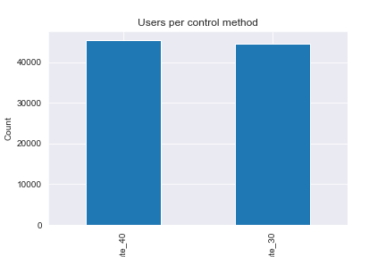
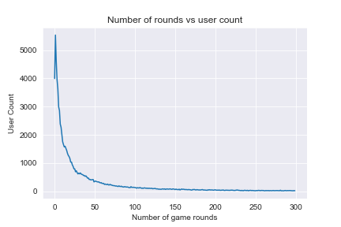
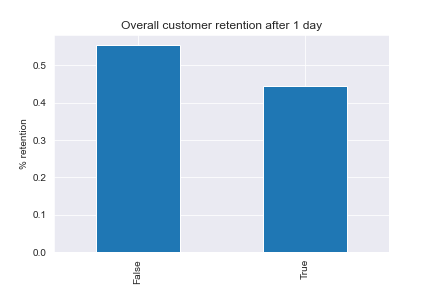

# Customer Retention -A/B Testing <!-- omit in toc -->
 
As they say, change is for the better. Sometimes when playing a game for too long or listening to a song too frequently, it can get very repetitive. Therefore taking a break or changing things up can help in playing a game for a longer time. But the question is, when is the best time to take this break?  

#### -- Project Status: [Completed]

# Table of Contents <!-- omit in toc -->

- [Synopsis](#synopsis)
- [Dataset](#dataset)
  - [Summary of the Dataset](#summary-of-the-dataset)
  - [Exploratory Analysis](#eda)
- [Bootstrapping and Retention Distribution](#bootstrapping)
- [Hypothesis Testing](#hypothesis)
- [Conclusion](#conclusion)

# Synopsis 

Mobile gaming has grown tremendously over the past few year and all these games have a common goal - to keep their users engaged and playing for as long as possible. Sometimes though, the best things even for the games to do is to force the user to take a break. In this project we will aim to identify if a break introduced after 30 levels is better than one after 40 levels for customer retention.

Python is used for this analysis and stats module from scipy is used to conduct hypothesis testing. 

# Dataset 

The dataset used for this project is from datacamp and can be found below: 

https://www.datacamp.com/projects/184

## Summary of the Dataset 

 - The dataset contains player habbits from over 90189 players of Cookie Cats and we are comparing player retential after 1 and 7 days while introducing two forces breaks. One after 30 rounds and another after 40 rounds of playing.

## Exploratory Analysis 

 - Before we conduct the hypothesis testing, we can infer some useful information on playing patterns.
 
 - Almost an equal number of players are tested on the different control methods as shown in the image below.

  
  
 - Very few players play more than 100 rounds of the game. 
 -  
  
  
- Almost 55% of the players stop playing after 1 day of installing the game. 

  

# Bootstrapping and Retention Distribution 

- The data contained a number of missing values for both numerical and categorical fields. The following methods were used to address the missing values:
  - Drop columns were majority of the values are missing
  - Drop columns were more almost all the values are of one category
  - Impute values based on linear regression, mean or mode depending on suitability 
- Feature engineering can add valuable information to the model by using exisiting features. Two new fewatures were created:
  - Age of the house
  - Total number of bathrooms
 - Categorical values are converted to numerical by using ordinal encoding and one hot encoding.    

## Hypothesis Testing 
- Cross validation is used the ensure that the model is not overfitting on the data.
- The following regression models are used:
  - Light Gradient Boosting Regressor
  - XGBoost Regressor
  - Gradient Boosting Regressor
  - Random Forest Regressor
  - Stacking CV Regressor

- The resuls obtained are then plotted and best 3 models are using to create and ensemble which is used in making predictions.

## Conclusion 

A prediction RMSE of 0.133 is obtained. This can be further improved by conducting hyperparamter tuning and uisng more models in the ensemble. 

