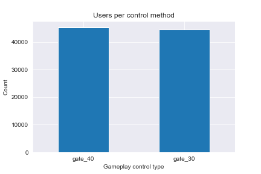

# Customer Retention -A/B Testing <!-- omit in toc -->
 
As they say, change is for the better. Sometimes when playing a game for too long or listening to a song too frequently, it can get very repetitive. Therefore taking a break or changing things up can help in playing a game for a longer time. But the question is, when is the best time to take this break?  

#### -- Project Status: [Completed]

# Table of Contents <!-- omit in toc -->

- [Synopsis](#synopsis)
- [Dataset](#dataset)
  - [Summary of the Dataset](#summary-of-the-dataset)
  - [Exploratory Analysis](#eda)
- [Bootstrapping and Retention Distribution](#bootstrapping)
- [Hypothesis Testing](#hypothesis)
- [Conclusion](#conclusion)

# Synopsis 

Mobile gaming has grown tremendously over the past few year and all these games have a common goal - to keep their users engaged and playing for as long as possible. Sometimes though, the best things even for the games to do is to force the user to take a break. In this project we will aim to identify if a break introduced after 30 levels is better than one after 40 levels for customer retention.

Python is used for this analysis and stats module from scipy is used to conduct hypothesis testing. 

# Dataset 

The dataset used for this project is from datacamp and can be found below: 

https://www.datacamp.com/projects/184

## Summary of the Dataset 

 - The dataset contains player habbits from over 90189 players of Cookie Cats and we are comparing player retential after 1 and 7 days while introducing two forces breaks. One after 30 rounds and another after 40 rounds of playing.

## Exploratory Analysis 

 - Before we conduct the hypothesis testing, we can infer some useful information on playing patterns.
 
 - Almost an equal number of players are tested on the different control methods as shown in the image below.

  
  
 - Very few players play more than 100 rounds of the game. 
 -  
  
  
- Almost 55% of the players stop playing after 1 day of installing the game. 

  

- Looking at the player retention after 1 and 7 days for the two control groups, it is hard to say which one performed better.. 

  
  
# Bootstrapping and Hypothesis Testing 

- Using the Central Limit Theorem, we know that the distribution of the mean of a sample data is a normal distribution. Bootstrapping with replacement is used to genereate a number of sample data combinations and the mean retention values are plotted for the two control methods.

 

- The null hypothesis and alternate hypothesis are chosen as follows:
  - Null Hypothesis (H0) : The two control methods have the same mean retention.  
  - Alternate Hypothesis (H1) : The two control methods do not have the same mean retention.  

- A student's t-test is conducted using the stats module from the scipy library.

## Conclusion 

A p value of 0 is obtained, which means that this result is statistically significant and the null hypothesis is rejected. 

Based on this the 30 level break is preferred for increased customer retention. 

